# IBM Devops 实践

本章主要是针对 

1.IBM Devops 工具链使用。

2.IBM Toolkit 实践（Katacode快速构建版本）。

3.Tekton 部署使用实践。

## 第一部分 IBM Devops 工具链使用

IBM Devops 提供的 Devops 服务分成两种：

基于 IBM Cloud 云服务底座提供的 [IBM Cloud Devops](https://www.ibm.com/cloud/devops)

混合云环境下的 [IBM Z Enterprise DevOps](https://www.ibm.com/it-infrastructure/z/capabilities/enterprise-devops)

### IBM Cloud Devops

IBM Cloud Devops 提供了开放的**工具链**以及很多符合各种企业需求的**工具链模板**，可自动构建和部署应用程序。

提供实现DevOps和DevSecOps方法的各种开源工具，通过创建支持开发，部署和操作任务的简单部署工具链来开始使用。

Delivery Pipeline （交付管道）是 IBM Devops 提供的工具链管理方式，交付包括以最少人工干预的可重复方式构建、测试和部署的交付管道。在管道中，阶段序列检索输入并运行作业，如构建、测试和部署。这里有两种管理方式，经典方式和**Tekton**方式。

#### 工具链

工具链提供了一组集成的工具，用于构建、部署和管理应用程序。您可以创建工具链以包含 IBM Cloud 服务、开放式源代码工具和第三方工具，**自由组装**，使开发和操作**可重复**并易于管理。


<center>图：IBM Cloud Devops 工具链工具</center>

开源工具内容涵盖了 Devops 实践内容：

- 项目管理和敏捷研发：

  **JIRA** 项目管理和跟踪
  
  **GitHub / GotLab / Bitbucket** 代码仓库
  
  **Slack** 项目协调和协作
  
  **Eclipse Orion Web IDE** 基于浏览器的IDE

- 持续交付

  **Jenkins** 持续集成
  
  **SonarQube** 代码质量检查
  
  **Sauce Labs** 自动执行项目的持续集成测试
  
  **Artifactory / Nexus** 构建制品存储
  
- 持续部署

  **Delivery Pipeline** 构建和部署 （必须，工具链通过 Delivery Pipeline 管理）
  
  **PagerDuty 当 Delivery Pipeline** 失败时发送警告

- 安全

  **Key Protect / HashiCorp Vault** 管理工具链私钥
  
- 监控和度量

  **无**
  
- 其他工具

  用户自定义方式集成工具，配置工具图标和工具实例 URL 使用其他工具集成到工具链中
  
##### 工具链集成

IBM Devops 工具集成相对简单，针对系统提供的这19种集成工具，可以使用公有部署和私有部署的集成能力，例如使用公有 GitLab 或私有的 GitLab ，而私有的集成方式基本使用 API 方式添加工具服务，并且在 IBM Cloud 中支持安装 CLI 来管理工具。

例如SonarQube工具集成：
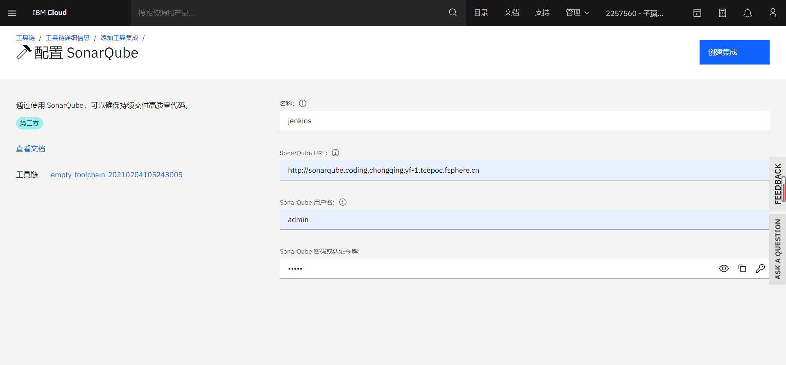
<center>图：IBM Cloud Devops SonarQube集成</center>

#### 工具链模板

提供快速建立适用于用户场景的工具链。


<center>图：IBM Cloud Devops 工具链模板</center>

### 对比 CODING 的优势
- CODING 提供的是一套相对固定的工具链，只能增减。
  IBM Devops 提出的工具链理念，提供各种开源 Devops 行业流行工具，可以更加灵活搭配使用。
  并且对外开放工具链添加接口，用户可以随意添加自己生产线上存在的工具。
  
- IBM Devops 与 IBM Cloud 相对于 CODING 与腾讯云关联性更强。在云服务提供的IaaS，PaaS服务基础上，使其Saas服务能无缝链接。
  同时也是跟 IBM Cloud 强绑定，如果不使用 IBM 提供的云资源，很多资源非开源，很难开展试用。

## 第二部分 IBM Toolkit 实践

IBM Toolkit 是 IBM Devops 提供的 Devops 开源工具的集合，具有以下特性：

**集群**：既托管工具又本身是应用程序构建的部署目标的Red Hat OpenShift或Kubernetes集群。

**后端服务**：原生云应用程序通常需要的云服务，用于监视，安全性和持久性。

**CI / CD**：预先构建的，可立即运行的持续交付管道，结合了一流的开源软件工具。

**入门工具包**：适用于常见应用程序组件和任务的预构建代码模板，结合了开发人员可以根据需要添加到其代码库中的最佳实践。

**仪表板**：集中式控制台，可帮助开发人员使用环境的功能。

### IBM Toolkit 安装

**安装环境**：OpenShift Origin是红帽基于开源的云平台，允许开发人员构建，测试和部署云应用。封装了原生 Kubernets ，集成 EFK 实现应用程序日志收集功能，Prometheus做系统监控。在 IBM Toolkit实践中区别 K8s 最重要的提升是使用基于 **RBAC 体系管理用户权限**，使集成进来的 Devops 工具自动继承 OpenShift 平台的用户权限管理，在CLI 和dashboard上同时支持。

#### Openshift 和 Kubernetes 对比

基本参数和能力对比：
|  | Kubernetes | OpenShift |
| :----: | :----: | :----: |
| 开发商 | 云原生计算基金会（CNCF） | 红帽（Rad Hat） |
| 开发语言 | Go | Go，Angular |
| 类型 | 集群管理软件 | 云计算，Paas |
| 使用 | 开源 | 开源 |
| CLI | kubectl | oc |
| 用户权限对接 | 接口支持 | 接口支持，多角色多用户管理，同时 CLI 和 Dashboard 支撑，易用性强 |
| 项目管理功能 | namespace | 在namespace基础上，增加project管理，同时 CLI 和 Dashboard 支撑，易用性更强 |
| CI / CD | 需要第三方继承支持 | 自身集成包括容器管理，原生Jenkins Pipeline |
| 日志监控 | Heapster | 集成EFK日志收集，Prometheus系统监控 |
| 版本控制 | 暂无 | 内置Git Server（IBM Cloud Devops提供了GitOps能力） |
| 负载均衡 | Ingress/kube-proxy | OpenShift HAProxy Router |

1.用户权限管理
OpenShift 和 Kubernetes 都提供针对例如Ldap的接口和众多认证系统对接。但在易用性上，Open'Shift


这里使用 [Katacode 试用环境安装](https://learn.openshift.com/playgrounds/openshift45/)，以下所有步骤都在 Katacode 提供的实验环境执行。

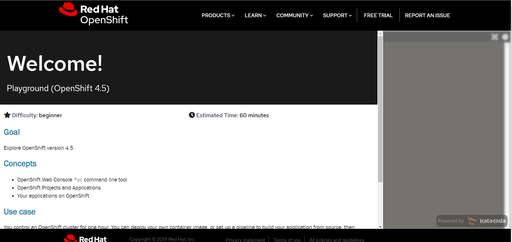

1. 注册公钥登录github，把公钥加入github，用于拉取toolkit工具包以及后续CI实践。
```shell
ssh-keygen -t rsa -b 4096 -C "amiesky@sina.cn"
cat ~/.ssh/id_rsa.pub
```
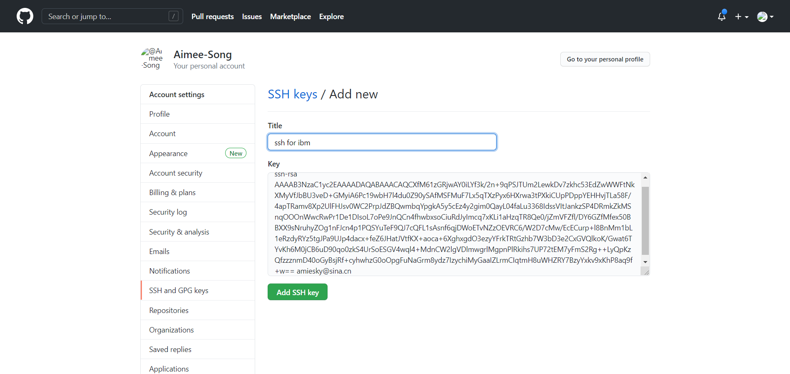

2. 下载toolkit安装包，并执行安装。
```shell
curl -LO https://raw.githubusercontent.com/ibm-garage-cloud/ibm-garage-iteration-zero/master/install/install-ibm-toolkit.yaml
oc create -f ./ibm-garage-iteration-zero/install/install-ibm-toolkit.yaml
sleep 5
oc wait pod -l job-name=ibm-toolkit --for=condition=Ready -n default
oc logs job/ibm-toolkit -f -n default
```
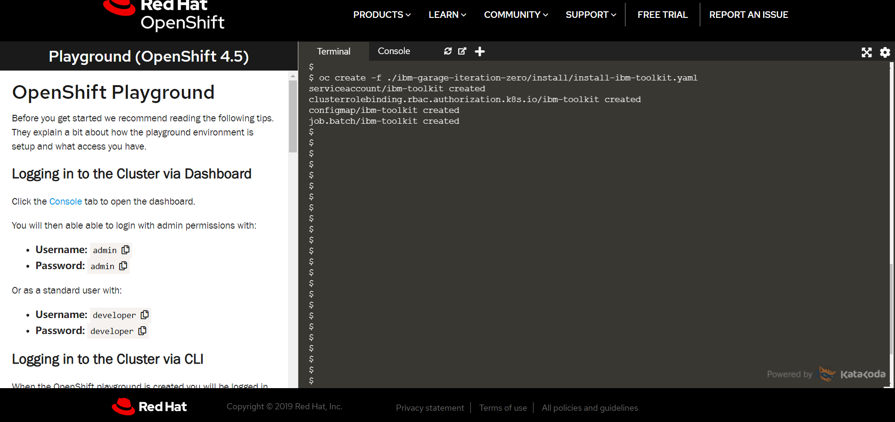
<center> 图：Toolkit安装执行</center>


<center> 图：Toolkit 安装完成</center>

在 OpenShift Dashboard 中可以看到 Toolkit 服务在集群中创建了一个命名空间是 tools 的项目。


<center>图：Toolkit 在 OpenShift 中管理</center>

3. 如果需要使用使用ibmcloud命令，可以通过CLI形式安装
```shell
curl -fsSL https://clis.cloud.ibm.com/install/linux | sh
ibmcloud --version
```
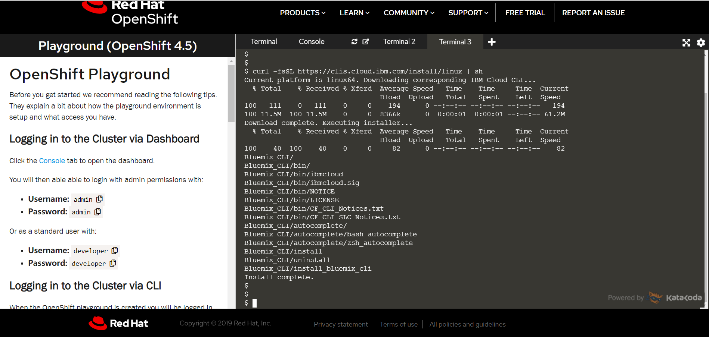
<center>图：ibmcloud 安装</center>


4. igc 命令安装
```shell
npm i -g @ibmgaragecloud/cloud-native-toolkit-cli
igc --version
```

实践过程中用到的命令指南：
|  | kubectl | oc | ibmcloud | igc |
| :----: | :----: | :----: | :----: | :----: |
| 系统 | Kubernetes | OpenShift | IBM Cloud | IBM Garage for Cloud（Cloud Native Toolkit CLI） |
| 应用 | 容器管理 | 容器管理及OpenShift新增功能 | IBM 云账号相关操作 | IBM Toolkit工具 |


5. toolkit部署成功后，可以在openshift dashboard后台看到添加的toolkit开源服务。
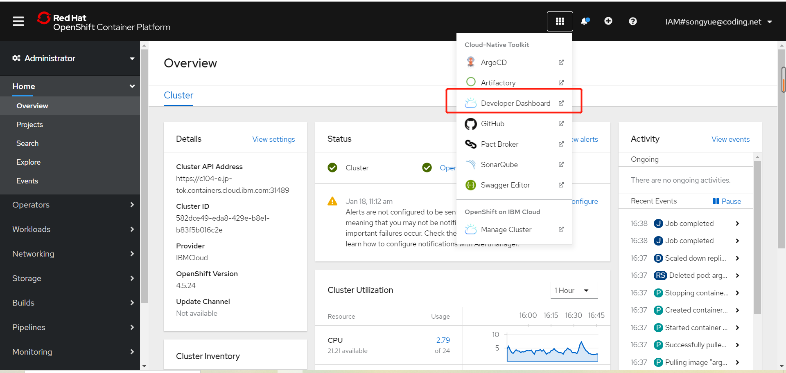

点击 Developer Dashboard 跳转至 Toolkit Web UI ，可以看到 OpenShift 为 Toolkit Dashboard 服务授权 RABC 。
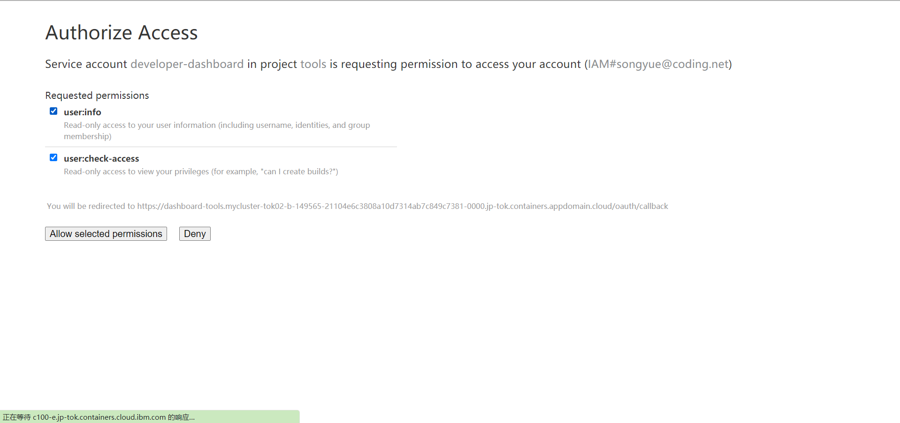

Toolkit 工具包中包含
**Swagger Editor**：使用 Swagger 生成项目 API 接口文档。
**ArgoCD**：声明式可视化 GitOps 交付工具，将集群中应用程序的实际状态与Git中定义的所需状态进行比较，并确定它们是否同步。
**Artifactory**：制品存储与管理，提供包括 Maven，Docker，npm，PIP，Helm 的制品管理。
**SonarQube**：静态代码扫描分析工具，提供代码可靠性，安全性质量检查。
**Image Registry**：镜像仓库。
**Pact Broker**：合同测试是一种通过单独检查每个应用程序，以确保其发送或接收的消息符合约定记录的测试技术。
**Developer Dashboard**：导航到集群中安装的 DevOps 工具，提供工具导航，帮助文档，代码仓库模板，工具使用指引，云原生开发部署指引。

访问方式可以通过 OpenShift 提供的导航，Developer Dashboard 以及 OC 命令找到。
```shell
## OC 命令导航到命名空间为 tools 暴露的服务
oc endpoints -n tools
```
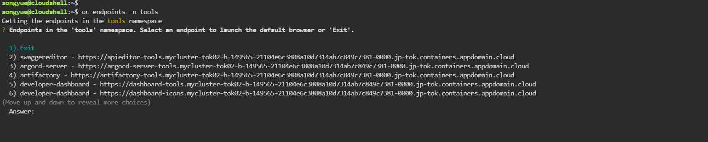

### IBM Toolkit 使用

IBM Toolkit 提供的开源工具跟IBM 工具链中提供的工具基本一致。

1.使用CLI命令创建新项目myproject，默认会跳转至新创建的项目下。
```shell
oc new-project myproject
```

2.使用toolkit提供的模板项目创建GitHub工程。

Toolkit 为开发人员提供了一系列创建程序的模板项目。
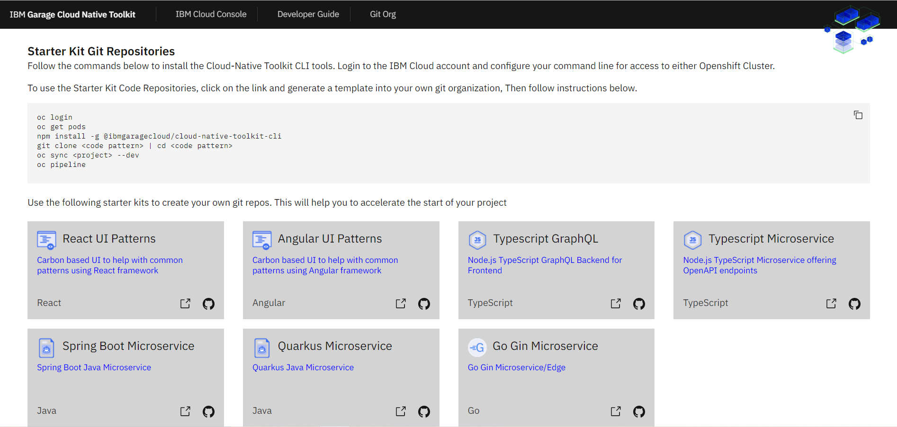

这里使用 Toolkit 提供的 SpringBoot Java Microservice 模板，创建 GitHub 代码仓库。
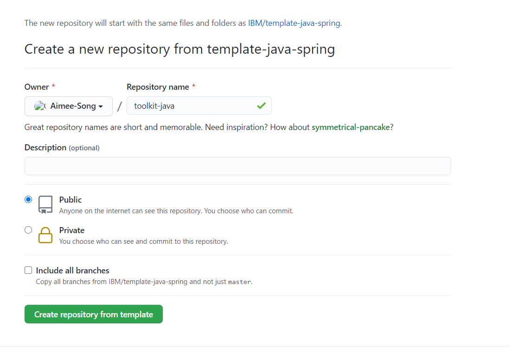

3. 使用 GitHub 代码仓库克隆地址，在 DevOps Pipeline 中注册刚刚创建的 Java 微服务项目。
```shell
oc pipeline https://github.com/Aimee-Song/toolkit-java.git
```

3.1 选择 Jenkins Pipeline 作为 Pipeline 构建工具。

填写 GitHub 用户名密码后，构建任务将开始执行。GitHub 用户名密码将通过名称为 " git-credentials " 的 Secret 进行管理。执行过程中会注册 Webhook 事件至 Jenkins，方便后续自动触发构建任务。


CI 任务开始执行后，可以通过 oc 命令查看 myproject 项目资源对象情况。
```shell
oc console
```
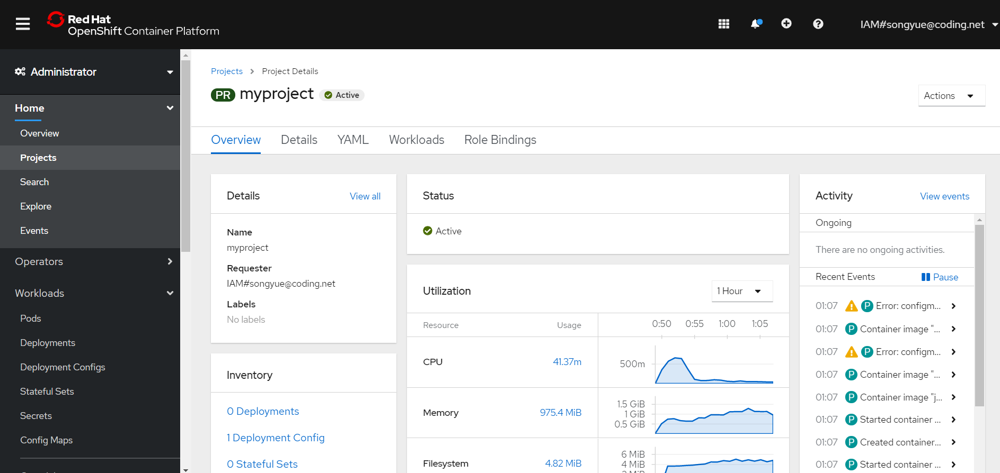

使用 Jenkins 执行的构建任务，同样能使用 oc 命令，查看 SpringBoot 项目构建详情。
```shell
oc endpoints
```
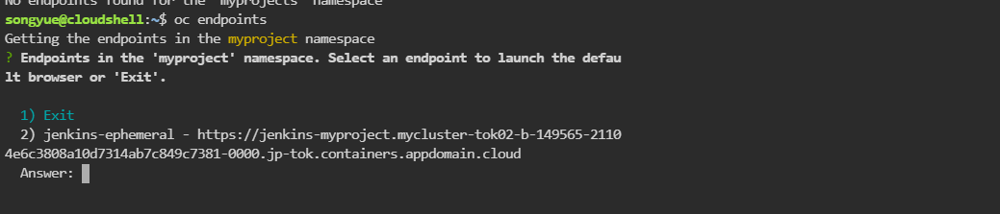

打开 OC 命令结果返回链接，跳转 Jenkins 后台查看构建详情。

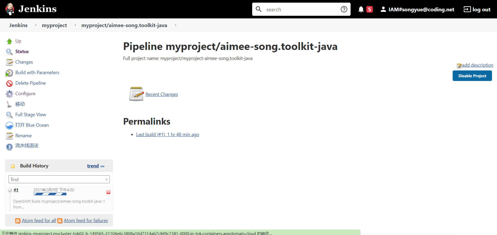

3.2 选择 Tekton Pipeline 作为 Pipeline 构建工具。

因上一场景填写过 GitHub 用户名密码保存到"git-credentials"管理，所以无需再填写。

注册 Tekton Pipeline 后，会添加镜像扫描步骤，如果使用 Toolkit 默认安装的 Image Registry 仓库，则由Vulnerability Advisor执行扫描；如果使用了其他图像注册表，则由Trivy执行扫描。 同时也会注册 Webhook 至 Tekton Trigger 管理。执行过程如下：

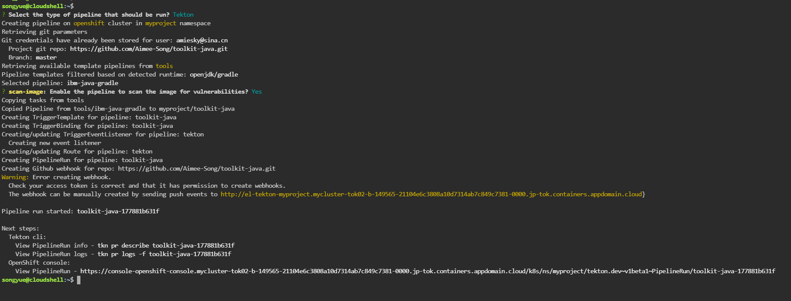

执行 OC 命令，获取 myproject 项目下 Pipeline 任务，这里可以看到 Tekton Dashboard 地址。

```shell
oc endpoints
```

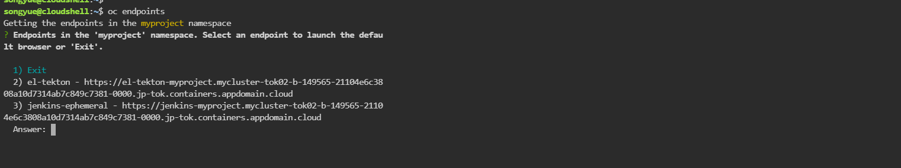

上面两张图返回的两个地址都是指向 Tekton 服务，一个是集成到 OpenShift Dashboard 中，一个是 Tekton 后台API地址。

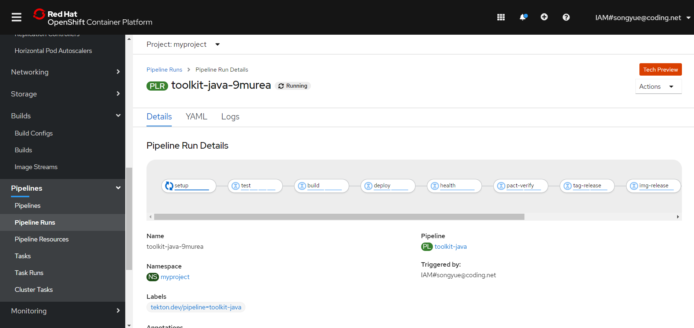
<center>图：OpenShift 集成 Tekton </center>

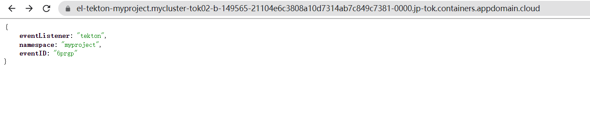
<center>图：Tekton Feedback  </center>

区别 Jenkins，Tekton 是集成至 OpenShift 中的，比 Jenkins Pipeline 集成更全面。这里包括 **Pipeline**，**PipelineRuns**在第三部分 Tekton 安装实践中详细描述。

Tekton Pipeline 执行结果：

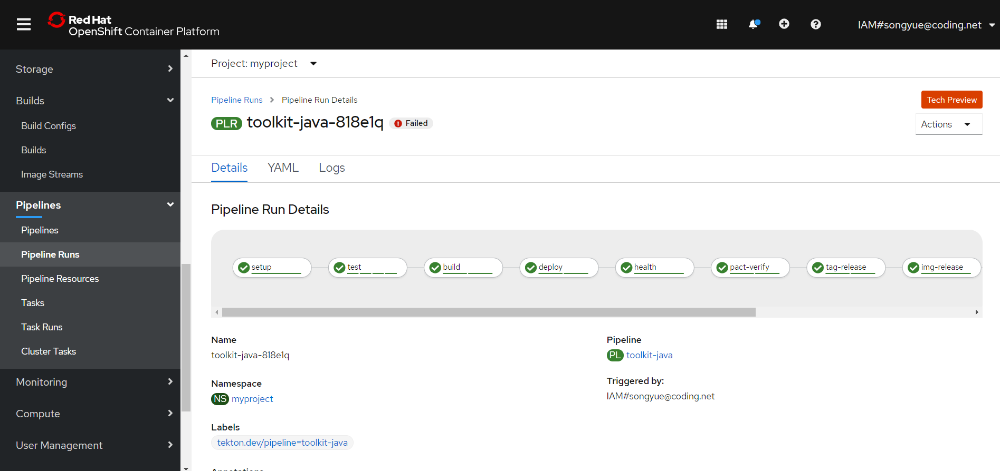

执行 OC 命令，查看 myproject 项目服务部署 SpringBoot 微服务地址。

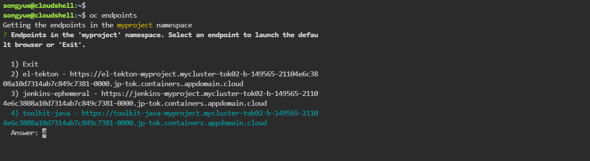

SpringBoot 微服务部署成功。

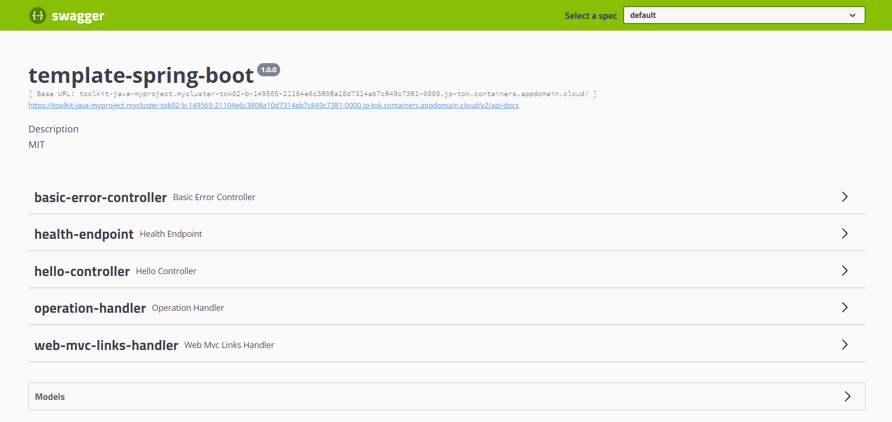

## 第三部分 Tekton 安装及实践

[Tekton](https://tekton.dev/) 是一款功能非常强大而灵活的 CI/CD 开源的云原生框架。Tekton 的前身是 Knative 项目的 build-pipeline 项目，这个项目是为了给 build 模块增加 pipeline 的功能，但是随着不同的功能加入到 Knative build 模块中，build 模块越来越变得像一个通用的 CI/CD 系统，于是，索性将 build-pipeline 剥离出 Knative，就变成了现在的 Tekton，而 Tekton 也从此致力于提供全功能、标准化的云原生 CI/CD 解决方案。

### Tekton 安装

Tekton 安装分为三部分，Tekton 开源工具在 Kubernetes 集群的安装，Tekton Dashboard 安装以及 Tekton CLI 命令行安装，后两个的安装不是必须的，选其一安装就能方便 Tekton 使用。

1. 在K8s集群中安装Tekton，执行Tekton资源文件。

```shell
kubectl apply -f https://github.com/Aimee-Song/ibm-devops.github.io/blob/gh-pages/tekton-release.yaml
```
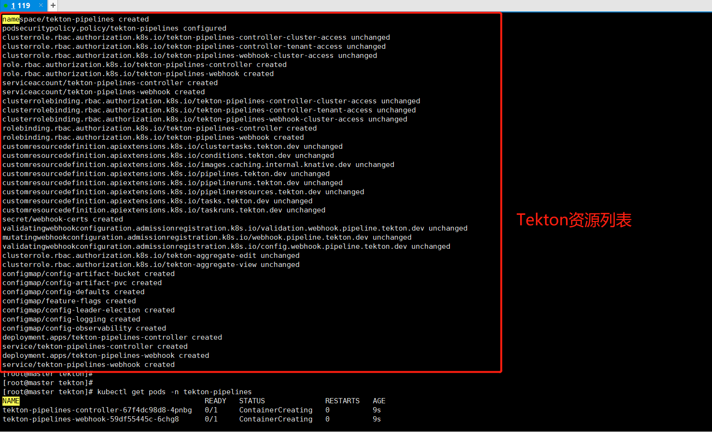

资源文件安装成功后，会生成tekton-pipelines命名空间，里面存在Tekton相关资源对象。

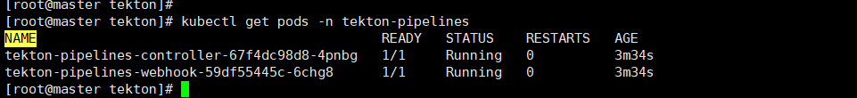

2. 如果需要使用命令行操作，可以安装 Tekton CLI 工具。

```shell
# 获取 Tekton 安装压缩包 tar.xz
curl -LO https://github.com/tektoncd/cli/releases/download/v0.15.0/tkn_0.15.0_Linux_x86_64.tar.gz
# 解压并将 Tekton 命令“tkn”添加到环境变量PATH下
sudo tar xvzf tkn_0.15.0_Linux_x86_64.tar.gz -C /usr/local/bin/ tkn
```

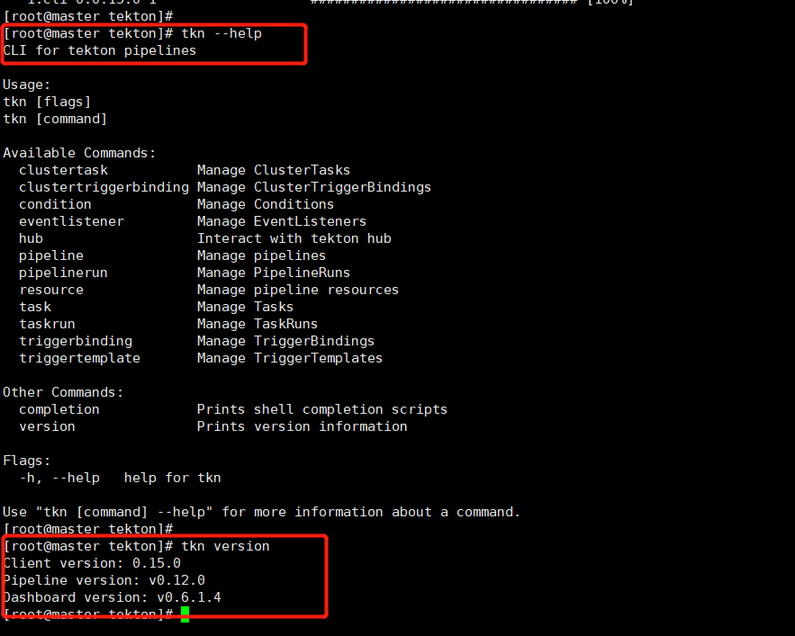

3. 同时，可以安装 Tekton Dashboard ，通过 Dashboard 查看 Tekton 整个任务的构建过程。

```shell
kubectl apply -f kubectl apply -f https://github.com/Aimee-Song/ibm-devops.github.io/blob/gh-pages/tekton-dashboard.yaml
```

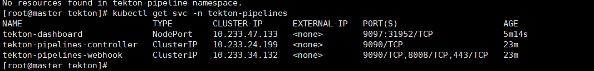

安装完成后，通过svc访问Tekton Web UI。

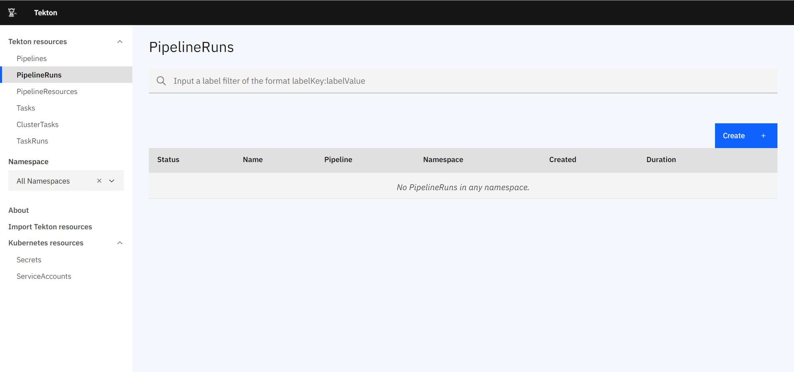


### Tekton 实践

这里使用简单的 SpringBoot Demo 项目，从 GitHub 仓库获取应用程序代码，测试及部署Demo服务。

Tekton 涉及到的资源对象，和  Jenkins 有很多类似的地方，区别是将 Pipeline 对象跟 Kubernetes 资源对象关联。

**Task**：表示执行命令的一系列步骤，task 里定义一系列 steps。类似 Jenkins 的 stage概念。

**TaskRun**：Task 的运行实例。

**ClusterTask**：整个集群的 Task 执行任务。Task 和 ClusterTask 的区别是，Task 与 namespaces 相关，ClusterTask 与 namespaces 无关。

**Pipeline**：一个或多个 Task 任务，包括 PipelineResource，类似 Jenkins Pipeline。

**PipelineRun**：Pipeline 的运行实例。

**PipelineResource**：执行 Pipeline 的输入输出资源。


## 第四部分 实践中遇到的新概念及问题汇总

### 新概念

1. **OpenShift** 是红帽的云开发平台即服务（PaaS），底层基于当前容器的事实标准编排系统Kubernetes和docker引擎，贯穿CI/CD流程，拥抱DevOps和敏捷开发。与 Kubernetes 对比在 IBM Toolkit 安装中有详述。

2. **GitOps** 是 DevOps 衍生的一种持续交付方式，它的核心思想是将应用系统的声明性基础架构和应用程序存放在Git版本库中。在 IBM Toolkit 中使用 ArgoCD 声明 GitOps 交付流程。

3. **Pact Broker**契约测试是在微服务大背景下越来越多团队关注的服务之间的交互的数据接口测试，主要针对一个服务生产者面对多个消费者场景，又称消费者驱动测试。对比功能测试，有以下区别：
|  | 功能测试 | 契约测试 |
| :---: | :---:| :---:|
| 测试内容 | 服务端实现 | 服务端改变是否影响每一个消费者 |
| 测试用例来源 | 服务端提供 | 消费端提供 |
| 测试个数 | 一个功能点对应一个测试流程 | 多个消费点对应多个测试流程 |


### 问题汇总
1. EACCES: Permission denied  问题，在执行 toolkit-cli 安装过程中，因为 IAM 分配权限不足，无权下载。
```shell
## 问题现象
songyue@cloudshell:~$ npm install -g @ibmgaragecloud/cloud-native-toolkit-cli
npm WARN deprecated request@2.88.2: request has been deprecated, see https://github.com/request/request/issues/3142
npm WARN deprecated har-validator@5.1.5: this library is no longer supported
npm WARN checkPermissions Missing write access to /usr/local/lib/node_modules
npm ERR! code EACCES
npm ERR! syscall access
npm ERR! path /usr/local/lib/node_modules
npm ERR! errno -13
npm ERR! Error: EACCES: permission denied, access '/usr/local/lib/node_modules'
npm ERR!  [Error: EACCES: permission denied, access '/usr/local/lib/node_modules'] {
npm ERR!   errno: -13,
npm ERR!   code: 'EACCES',
npm ERR!   syscall: 'access',
npm ERR!   path: '/usr/local/lib/node_modules'
npm ERR! }
npm ERR! 
npm ERR! The operation was rejected by your operating system.
npm ERR! It is likely you do not have the permissions to access this file as the current user
npm ERR! 
npm ERR! If you believe this might be a permissions issue, please double-check the
npm ERR! permissions of the file and its containing directories, or try running
npm ERR! the command again as root/Administrator.

npm ERR! A complete log of this run can be found in:
npm ERR!     /home/songyue/.npm/_logs/2021-02-09T16_16_07_434Z-debug.log

## 解决办法：IBM Toolkit 官方不建议将 sudo 与 npm 一起使用，提供两种解决方案，链接：http://npm.github.io/installation-setup-docs/installing/a-note-on-permissions.html
## 这里尝试第二种成功安装 toolkit-cli，思路是不修改默认目录所有权，将npm配置为使用新建的隐藏目录进行全局下载。
```

2. Toolkit 关联 GitHub Webhook 失败，导致无法自动触发 Pipeline 任务。
```shell
## 错误现象
songyue@cloudshell:~$ oc pipeline https://github.com/Aimee-Song/toolkit-java.git
? Select the type of pipeline that should be run? Jenkins
Creating pipeline on openshift cluster in myproject namespace
Creating secret(s) with git credentials
  Project git repo: https://github.com/Aimee-Song/toolkit-java.git
? Provide the git username: amiesky@sina.cn
? Provide the git password or personal access token: [hidden]
  Branch: master
Setting up Jenkins environment
Installing Jenkins
Copying Jenkins credentials
Adding privileged scc to jenkins serviceAccount
Registering pipeline: Aimee-Song.toolkit-java
Creating git webhook
Warning: Error creating webhook. The webhook can be manually created by sending push events to https://jenkins-myproject.mycluster-tok02-b-149565-21104e6c3808a10d7314ab7c849c7381-0000.jp-tok.containers.appdomain.cloud
```
