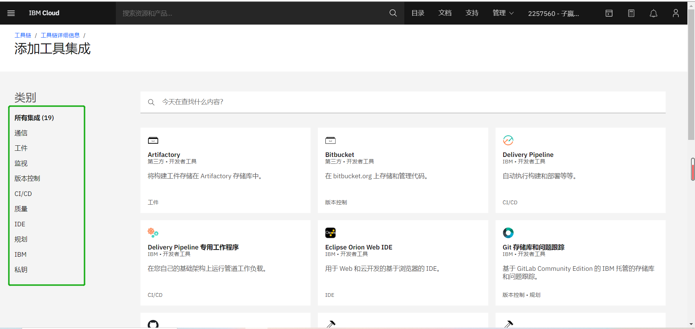
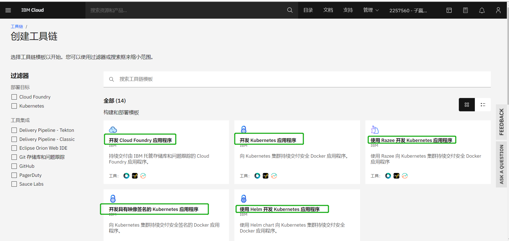

## IBM Devops 实践

IBM Devops 提供的 Devops 服务分成两种：

基于 IBM Cloud 云服务底座提供的 [IBM Cloud Devops](https://www.ibm.com/cloud/devops)

混合云环境下的 [IBM Z Enterprise DevOps](https://www.ibm.com/it-infrastructure/z/capabilities/enterprise-devops)

### IBM Cloud Devops

IBM Cloud Devops 提供了开放的**工具链**以及很多符合各种企业需求的**工具链模板**，可自动构建和部署应用程序。

提供实现DevOps和DevSecOps方法的各种开源工具，通过创建支持开发，部署和操作任务的简单部署工具链来开始使用。

#### 工具链

工具链提供了一组集成的工具，用于构建、部署和管理应用程序。您可以创建工具链以包含 IBM Cloud 服务、开放式源代码工具和第三方工具，**自由组装**，使开发和操作**可重复**并易于管理。

开源工具内容涵盖了 Devops 实践内容：

- 项目管理和敏捷研发：
  JIRA 项目管理和跟踪
  GitHub / GotLab / Bitbucket 代码仓库
  Git 存储库和问题跟踪 IBM 托管且基于 GitLab Community Edition 构建的 Git 存储库和问题跟踪
  Slack 项目协调和协作
  Eclipse Orion Web IDE 基于浏览器的IDE

- 持续交付
  Jenkins 持续集成
  SonarQube 代码质量检查
  Sauce Labs 自动执行项目的持续集成测试
  Artifactory / Nexus 构建制品存储
  
- 持续部署
  Delivery Pipeline 构建和部署
  PagerDuty 当 Delivery Pipeline 失败时发送警告
  
- 安全
  Key Protect / HashiCorp Vault 管理工具链私钥
  
- 监控和度量
  无
  

<center>图：IBM Cloud Devops 工具链工具</center>


#### 工具链模板



<center>图：IBM Cloud Devops 工具链模板</center>


### 对比 CODING 的优势
- CODING 提供的是一套相对固定的工具链，只能增减。
  IBM Devops 提出的工具链理念，提供各种开源 Devops 行业流行工具，可以更加灵活搭配使用。
  
- IBM Devops 与 IBM Cloud 相对于 CODING 与腾讯云关联性更强。在云服务提供的IaaS，PaaS服务基础上，使其Saas服务能无缝链接。
```markdown
Syntax highlighted code block

# Header 1
## Header 2
### Header 3

- Bulleted
- List

1. Numbered
2. List

**Bold** and _Italic_ and `Code` text

[Link](url) and 
```

For more details see [GitHub Flavored Markdown](https://guides.github.com/features/mastering-markdown/).

### Jekyll Themes

Your Pages site will use the layout and styles from the Jekyll theme you have selected in your [repository settings](https://github.com/Aimee-Song/ibm-devops.github.io/settings). The name of this theme is saved in the Jekyll `_config.yml` configuration file.

### Support or Contact

Having trouble with Pages? Check out our [documentation](https://docs.github.com/categories/github-pages-basics/) or [contact support](https://support.github.com/contact) and we’ll help you sort it out.
